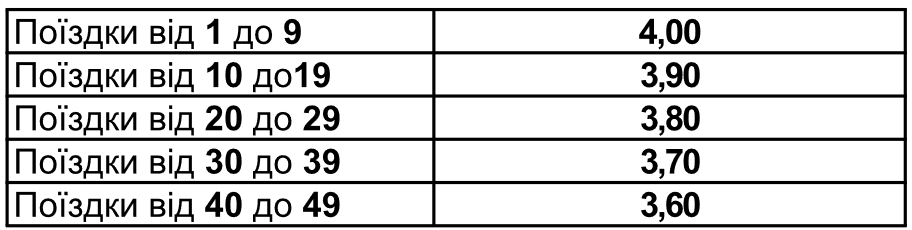

# Массивы

## Домашнее задание

## Задание 1

В метро действует следующая система пополнения бесконтактных карт. Записать данные из
таблицы, используя структуры данных объект и массив.
Пользователь вводит сумму пополнения – вывести информацию о количестве поездок, стоимости
и сдаче. Распечатать информацию о стоимости всех поездок из выбранного им диапазона.

## Задание 2

Дана строка с числами и строками (задать самостоятельно). Преобразовать ее в массив. Разделить
полученный массив на два – первый должен содержать только строчные элементы, второй –
только числа.
Строчный - преобразовать обратно в строку, в качестве разделителя использовать «-».
Каждый элемент числового массива увеличить в 2 раза. Вывести исходный массив и измененный.

## Литература

<https://learn.javascript.ru/array>    
<https://learn.javascript.ru/array-methods>